# 基于Springboot的论坛网站

## Springboot-0084


## 技术栈

Springboot mybatisplus vue mysql maven


## 数据库表(11张)


## 功能介绍

```properties
管理员，用户，普通管理员。

管理员功能有个人中心，用户管理，普通管理员管理，论坛类别管理，交流论坛管理，系统管理等。

用户功能有个人中心，交流论坛管理，我的收藏管理，系统管理等。

普通管理员有个人中心，交流论坛管理等
```


## 图片

### 前台

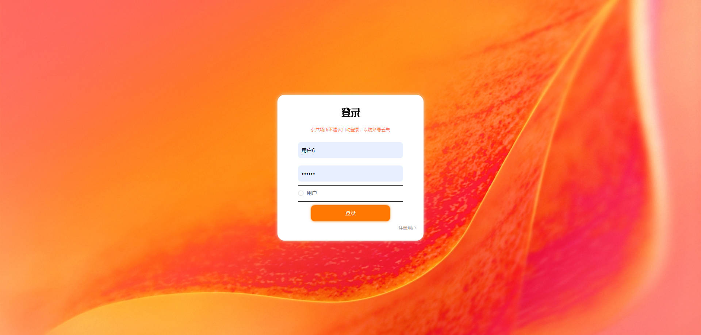


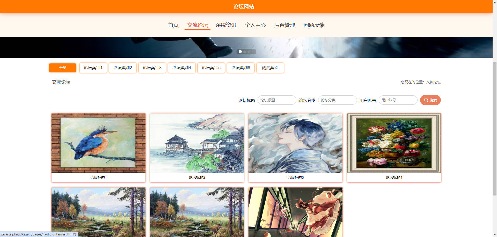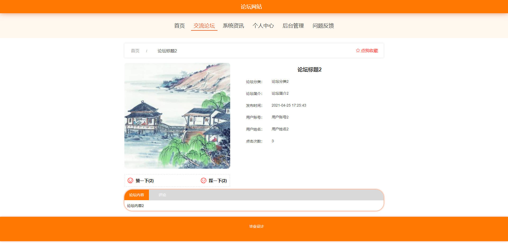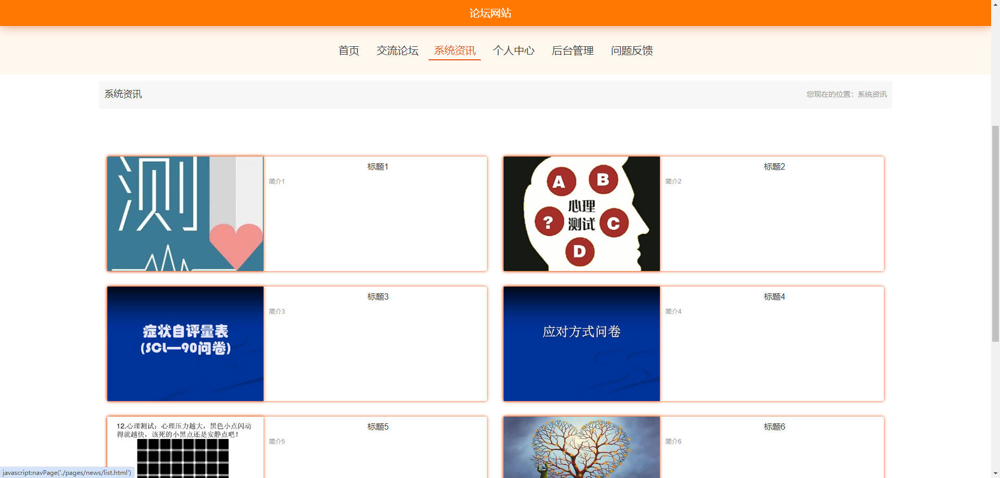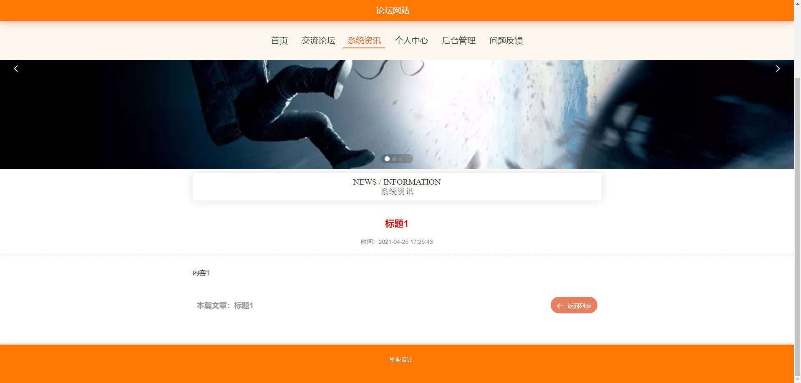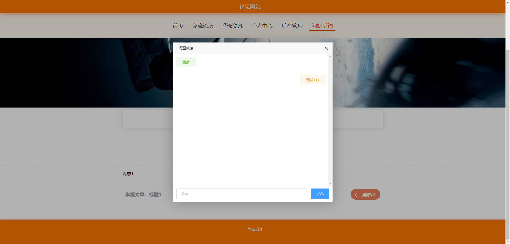

### 后台

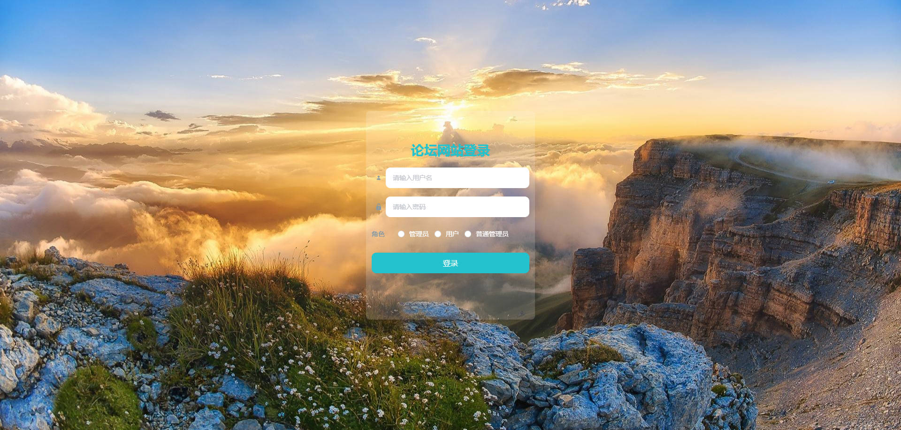

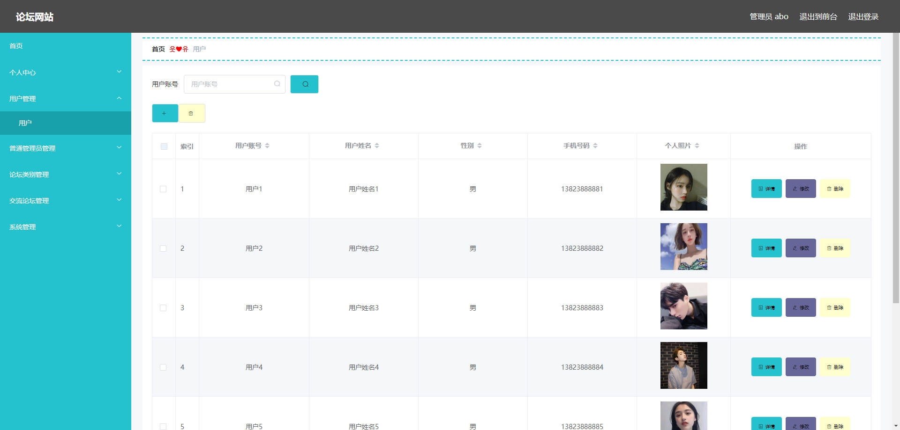

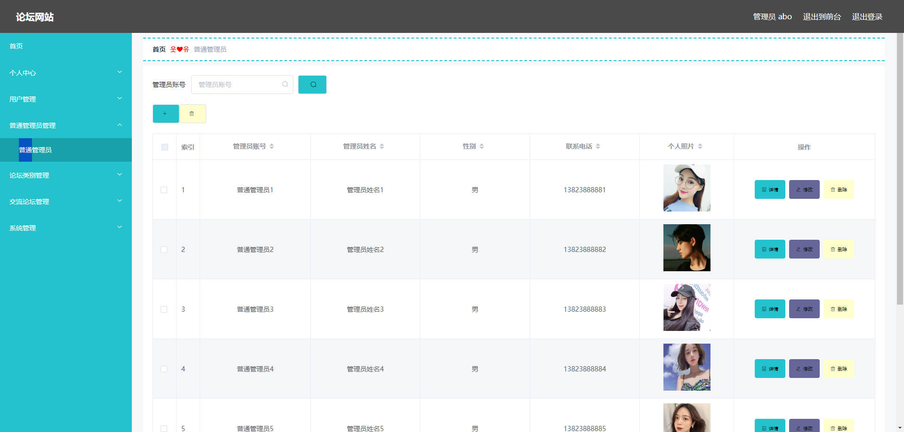

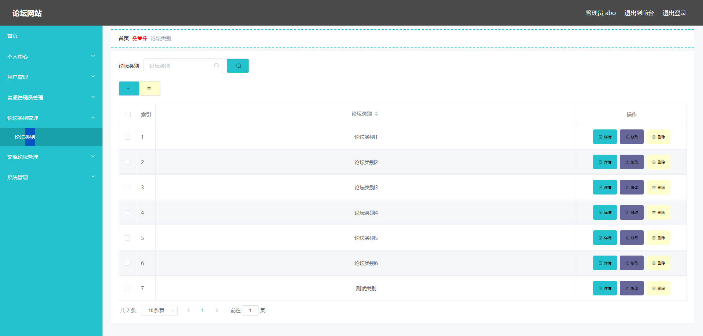

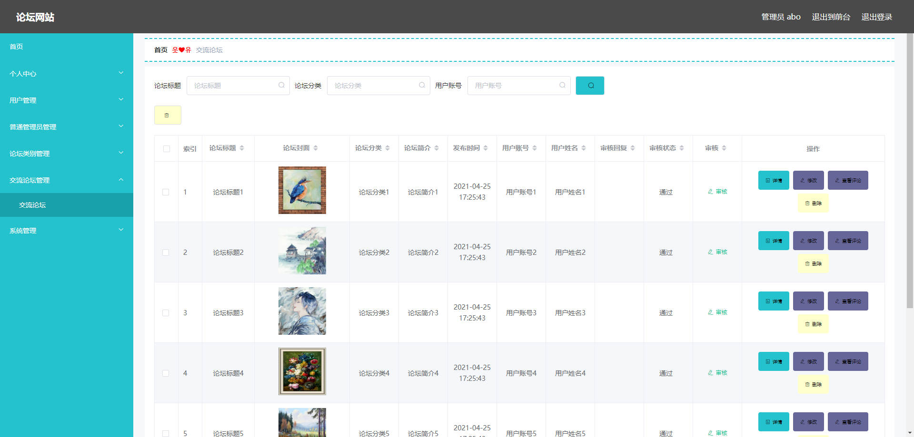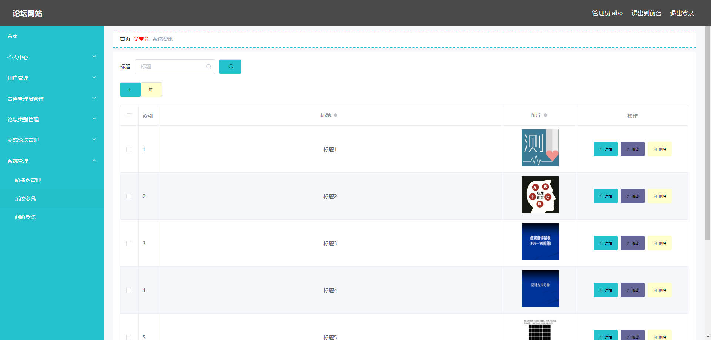


## 访问路径

### 前台

```properties
http://localhost:8080/springboot34t91/front/pages/login/login.html

账号 1234
密码 1234
```

### 后台

```properties
http://localhost:8080/springboot34t91/admin/dist/index.html#/login

账号 abo
密码 abo
```


## 功能图

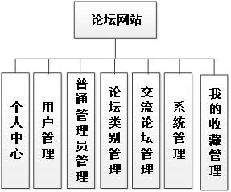


## 文档目录

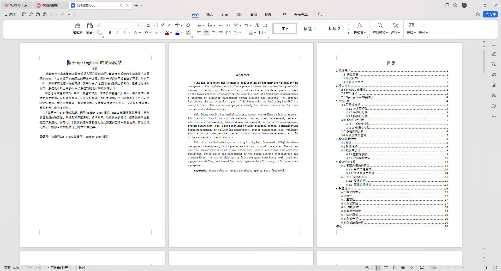


## 打赏或交流


